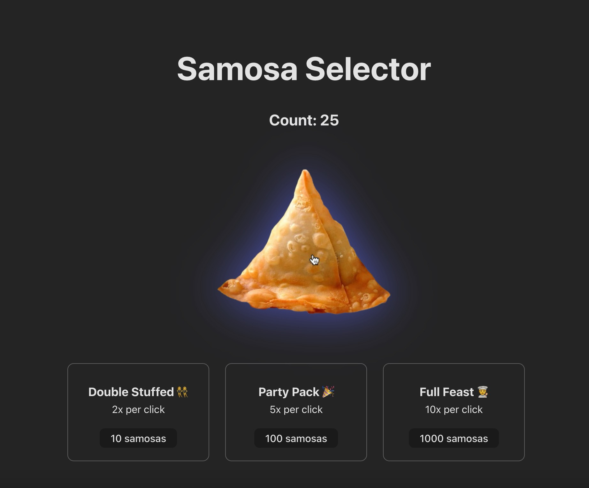

# 🥟 Samosa Selector Game

Welcome to **Samosa Selector** – the tastiest clicking adventure on the internet! Inspired by the classic **Cookie Clicker**, your mission is simple:  
Click on the **Big Samosa** to grow your samosa empire, unlock mouth-watering upgrades, and become the ultimate samosa tycoon.  

---

## 📸 Screenshot

---

## 🎮 Gameplay

You start with **zero samosas**. Every click on the **Big Samosa** earns **1 samosa**.  
As your stash grows, you’ll unlock flavorful upgrades to supercharge your samosa production:

### 🥟 Double Stuffed Upgrade
- Unlocks at **10 samosas**  
- Doubles samosas earned per click  

### 🎉 Party Pack Upgrade
- Unlocks at **100 samosas**  
- Multiplies samosas per click by **5**  

### 🍽 Full Feast Upgrade
- Unlocks at **1000 samosas**  
- Multiplies samosas per click by **10**  

---

## 🕹 How to Play
1. **Click** the **Big Samosa** to earn your first samosa.  
2. **Save up** to buy upgrades that boost your production.  
3. **Stack up** samosas endlessly and watch your empire grow!  

---

## ✨ Features
- Addictive click-based gameplay  
- Multiple upgrade tiers to accelerate your gains  
- Infinite progression for endless fun  
- Satisfying feedback with every click  

---

## 🍴 Enjoy the Game!
Keep clicking, keep upgrading, and keep feasting on your ever-growing samosa empire.  
Remember: there’s no such thing as *too many* samosas. 😋

---

## ⚖️ License

    Copyright [2025] [Kelvin Mathew]

    Licensed under the Apache License, Version 2.0 (the "License");
    you may not use this file except in compliance with the License.
    You may obtain a copy of the License at

        http://www.apache.org/licenses/LICENSE-2.0

    Unless required by applicable law or agreed to in writing, software
    distributed under the License is distributed on an "AS IS" BASIS,
    WITHOUT WARRANTIES OR CONDITIONS OF ANY KIND, either express or implied.
    See the License for the specific language governing permissions and
    limitations under the License.